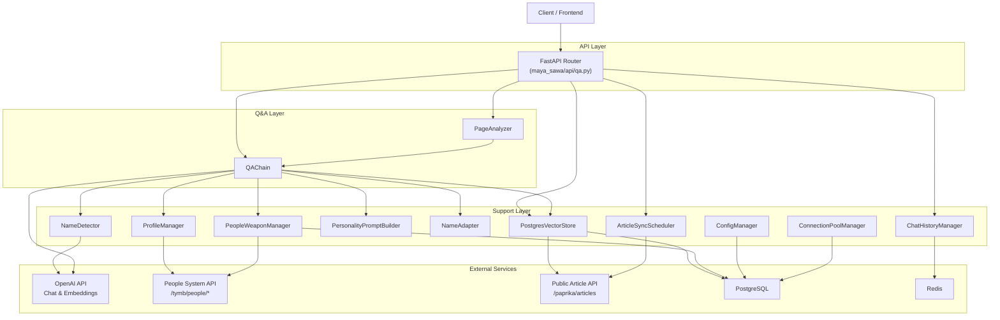

# Maya Sawa

  

> A Multi-AI Agent Q&A System integrating role-play, document retrieval, Vector semantics, and FastAPI.

## Table of Contents

- [Background](#background)
- [Install](#install)
- [Usage](#usage)
- [Architecture](#architecture)
- [Design Patterns](#design-patterns)
- [Deployment](#deployment)
- [Other](#other)

## Background

### AI 能力概述

#### 多人格 AI 代理
- **角色扮演系統**：支援多角色對話，每個角色具有獨特的性格和背景設定
- **智能名稱檢測**：自動識別查詢中的人物名稱，提供個性化回應
- **動態人格建構**：根據角色檔案動態生成符合角色特質的對話風格

#### 智能文檔檢索與問答
- **向量化搜索**：使用 OpenAI Embeddings 進行語義相似度搜索
- **RAG (Retrieval-Augmented Generation)**：結合檢索和生成，提供準確的基於文檔的回答
- **多語言支援**：支援中文和英文雙語問答，自動翻譯回應
- **頁面內容分析**：提供網頁內容摘要、重點提取、技術分析等功能

#### 智能數據同步
- **自動文章同步**：從外部 API 自動同步文章並生成向量嵌入
- **人員武器數據管理**：同步和管理角色、武器等相關數據
- **預計算嵌入支援**：支援使用預計算的向量嵌入，提升同步效率
- **定期同步排程**：可配置的定期數據同步機制

#### 對話管理
- **多用戶對話歷史**：支援多用戶獨立的對話記錄管理
- **Redis 快取**：高效的對話歷史存儲和檢索
- **上下文感知**：基於歷史對話提供連貫的回應

## Install

### Getting Started

#### 環境要求
- Python 3.8+
- PostgreSQL (支援 pgvector 擴展)
- Redis
- Aiven Free Tier PostgreSQL (最多 20 個連接)

#### 雙數據庫配置
系統使用雙數據庫架構：
- **主數據庫**: 用於 articles 表 (向量搜索)
- **人員數據庫**: 用於 people 和 weapon 表 (角色和武器數據)

#### 連接池配置
系統已配置為每個數據庫最多使用 5 個 PostgreSQL 連接：
- **主數據庫**: 最多 5 個連接 (articles 表)
- **人員數據庫**: 最多 5 個連接 (people/weapon 表)
- 每個數據庫都符合單一數據庫 5 連接限制
- 所有數據庫操作都通過連接池管理

#### 啟動應用
```bash
poetry run uvicorn maya_sawa.main:app --reload --log-level debug --host 0.0.0.0 --port 8000
```

#### 測試連接池
```bash
python scripts/test_connection_pool.py
```

#### 監控連接使用情況
```bash
python scripts/monitor_connections.py
```

## Usage

### API Examples

```bash
## Sync articles
curl -X POST "http://localhost:8000/maya-sawa/qa/sync-from-api" \
  -H "Content-Type: application/json" \
  -d '{}'

## Force local embedding
curl -X POST "http://localhost:8000/maya-sawa/qa/sync-articles" \
  -H "Content-Type: application/json" \
  -d '{}'
```

```bash
curl -X POST "http://localhost:8000/maya-sawa/qa/query" \
  -H "Content-Type: application/json" \
  -d '{"text":"Who is Sorane?","user_id":"dev","language":"english","name":"Maya","frontend_source":"/tymultiverse"}'

curl -X POST "http://localhost:8000/maya-sawa/qa/query" \
  -H "Content-Type: application/json" \
  -d '{"text":"誰是Sorane?","user_id":"dev","language":"chinese","name":"Maya","frontend_source":"/tymultiverse"}'

curl -X POST "http://localhost:8000/maya-sawa/qa/query" \
  -H "Content-Type: application/json" \
  -d '{"text":"你認識 Sorane嗎?","user_id":"dev","language":"chinese","name":"Maya","frontend_source":"/tymultiverse"}'

curl -X POST "http://localhost:8000/maya-sawa/qa/query" \
  -H "Content-Type: application/json" \
  -d '{"text":"你是誰?","user_id":"dev","language":"chinese","name":"Maya","frontend_source":"/tymultiverse"}'
```

```bash
curl -X POST "http://localhost:8000/maya-sawa/qa/query" \
  -H "Content-Type: application/json" \
  -d '{"text":"什麼是Java開發?","user_id":"dev","language":"chinese","name":"Maya","frontend_source":"/tymultiverse"}'

curl -X POST "https://peoplesystem.tatdvsonorth.com/maya-sawa/qa/query" \
  -H "Content-Type: application/json" \
  -d '{"text":"什麼是Java開發?","user_id":"dev","language":"chinese","name":"Maya"}'

curl -X POST "http://localhost:8000/maya-sawa/qa/query" \
  -H "Content-Type: application/json" \
  -d '{"text":"什麼是Java開發?","user_id":"dev","language":"chinese","name":"Maya"}'
```

```bash
curl -X GET "http://localhost:8000/maya-sawa/qa/chat-history/dev"
```

### Troubleshooting

```bash
curl -X POST "http://localhost:8000/maya-sawa/qa/sync-articles" \
  -H "Content-Type: application/json" \
  -d '{}'
```

## Architecture

### System Architecture

```mermaid
graph TD
    A["User Request</br>(/qa/query)"] --> B{FastAPI Router};
    B --> C["qa_chain.get_answer(query)"];
    C --> D{"Detect names in query"};
    
    %% å稱檢測分支
    D -- "Names found" --> E["Fetch character profiles</br>from DB"];
    E --> F{"Profile found?"};
    F -- "Yes" --> G["Create prompt with</br>character profile"];
    F -- "No" --> H["Respond 'not found'"];
    
    %% ç„¡å稱分支
    D -- "No names found" --> I{"Semantic search for people"};
    I -- "People found" --> J["Generate answer from</br>search results"];
    I -- "No one found" --> K["Similarity search</br>in Vector Store"];
    K --> L["Create prompt with</br>document context"];
    
    %% 統一處ç†
    G --> M["Invoke LLM"];
    J --> M;
    L --> M;
    H --> N["Return final answer"];
    M --> N;
    N --> O["Save chat history"];
    O --> P["Return AI answer"];
    P --> B;
```





## Design Patterns

### 🎯 設計模式 (Design Patterns)

本專案主要採用以下設計模式來實現清晰且可維護的架構：

- **責任鏈模式 (Chain of Responsibility)**: 使用 LangChain 實現問答處理流程，讓不同模組依序處理請求。
- **策略模式 (Strategy Pattern)**: 根據用戶查詢是否包含特定人名，動態切換不同的資訊檢索與提示生成策略。
- **工廠模式 (Factory Pattern)**: 動態組裝與生成不同 AI 角色專屬的 Personality Prompt。

## Deployment

### Deployment

```bash
docker build -t papakao/maya-sawa:latest .
```

```bash
poetry install
poetry run uvicorn maya_sawa.main:app --reload --log-level debug --host 0.0.0.0 --port 8000
```

## Other

### Environment Variables

- `OPENAI_API_KEY`: OpenAI API key
- `OPENAI_ORGANIZATION`: OpenAI organization ID
- `DB_HOST`, `DB_PORT`, `DB_DATABASE`, `DB_USERNAME`, `DB_PASSWORD`: PostgreSQL connection
- `REDIS_HOST`, `REDIS_CUSTOM_PORT`, `REDIS_PASSWORD`: Redis connection
- `MATCH_COUNT`: Number of documents to retrieve (default: 3)
- `SIMILARITY_THRESHOLD`: Similarity threshold for document matching (default: 0.5)
- `FORCE_LOCAL_EMBEDDING`: Force local embedding computation, ignore upstream embeddings (default: false)
- `VALIDATE_UPSTREAM_EMBEDDING`: Validate upstream embeddings before use (default: true)
- `ENABLE_AUTO_SYNC_ON_STARTUP`: Auto-sync on application startup (default: false)
- `ENABLE_PERIODIC_SYNC`: Enable periodic article sync (default: false)
- `ENABLE_PEOPLE_WEAPONS_SYNC`: Enable people/weapons data sync (default: false)

