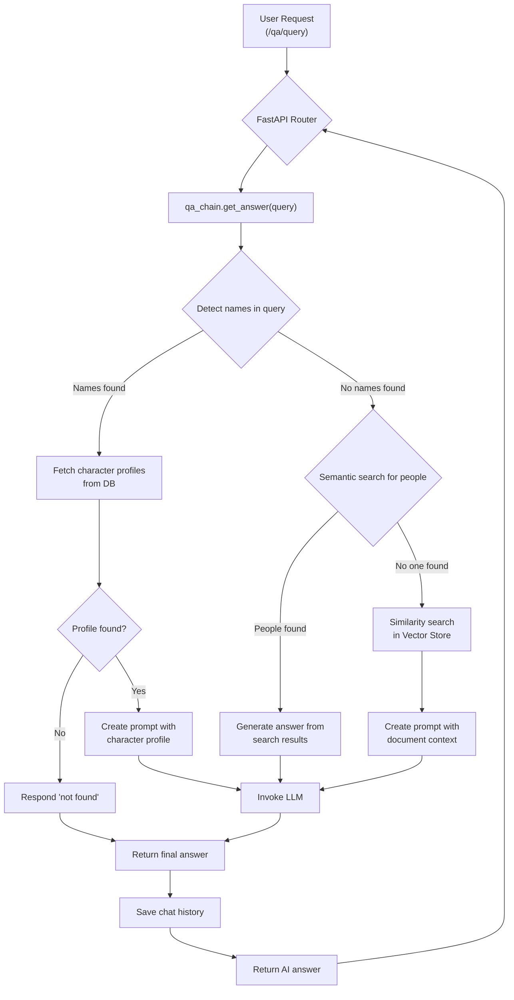
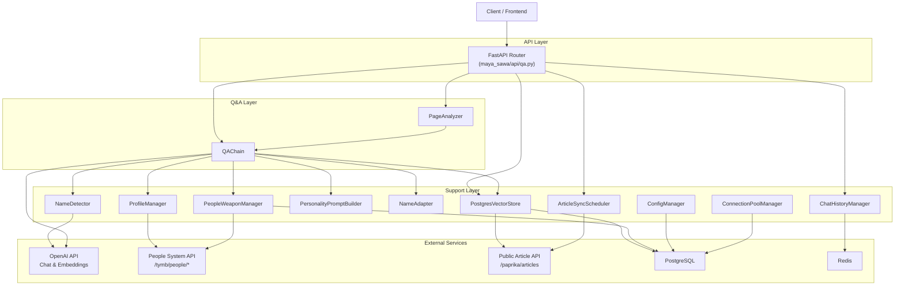

# Maya Sawa

  

> A Multi-AI Agent Q&A System integrating role-play, document retrieval, Vector semantics, and FastAPI.

## Table of Contents

- [Background](#background)
- [Architecture](#architecture)
- [Design Patterns](#design-patterns)
- [Other](#other)

## Background

### AI 能力概述

#### 多人格 AI 代理
- **角色扮演系統**：支援多角色對話，每個角色具有獨特的性格和背景設定
- **智能名稱檢測**：自動識別查詢中的人物名稱，提供個性化回應
- **動態人格建構**：根據角色檔案動態生成符合角色特質的對話風格

#### 智能文檔檢索與問答
- **向量化搜索**：使用 OpenAI Embeddings 進行語義相似度搜索
- **RAG (Retrieval-Augmented Generation)**：結合檢索和生成，提供準確的基於文檔的回答
- **多語言支援**：支援中文和英文雙語問答，自動翻譯回應
- **頁面內容分析**：提供網頁內容摘要、重點提取、技術分析等功能

#### 智能數據同步
- **自動文章同步**：從外部 API 自動同步文章並生成向量嵌入
- **人員武器數據管理**：同步和管理角色、武器等相關數據
- **預計算嵌入支援**：支援使用預計算的向量嵌入，提升同步效率
- **定期同步排程**：可配置的定期數據同步機制

#### 對話管理
- **多用戶對話歷史**：支援多用戶獨立的對話記錄管理
- **Redis 快取**：高效的對話歷史存儲和檢索
- **上下文感知**：基於歷史對話提供連貫的回應

### 環境要求
- Python 3.8+
- PostgreSQL（支援 pgvector 擴展）
- Redis
- 雙數據庫架構：主數據庫（articles）+ 人員數據庫（people/weapon）

> 啟動指令、API 範例、部署流程請見 [AGENTS.md](AGENTS.md)；本地開發注意事項請見 [CLAUDE.md](CLAUDE.md)。

## Architecture

### System Architecture

```mermaid
graph TD
    A["User Request</br>(/qa/query)"] --> B{FastAPI Router};
    B --> C["qa_chain.get_answer(query)"];
    C --> D{"Detect names in query"};
    
    %% 名稱檢測分支
    D -- "Names found" --> E["Fetch character profiles</br>from DB"];
    E --> F{"Profile found?"};
    F -- "Yes" --> G["Create prompt with</br>character profile"];
    F -- "No" --> H["Respond 'not found'"];
    
    %% 無名稱分支
    D -- "No names found" --> I{"Semantic search for people"};
    I -- "People found" --> J["Generate answer from</br>search results"];
    I -- "No one found" --> K["Similarity search</br>in Vector Store"];
    K --> L["Create prompt with</br>document context"];
    
    %% 統一處理
    G --> M["Invoke LLM"];
    J --> M;
    L --> M;
    H --> N["Return final answer"];
    M --> N;
    N --> O["Save chat history"];
    O --> P["Return AI answer"];
    P --> B;
```

```mermaid
flowchart TD
    subgraph "API Layer"
        APIRouter["FastAPI Router<br/>(maya_sawa/api/qa.py)"]
    end

    subgraph "Q&A Layer"
        QAChain["QAChain"]
        PageAnalyzer["PageAnalyzer"]
    end

    subgraph "Support Layer"
        NameDetector["NameDetector"]
        ProfileManager["ProfileManager"]
        PeopleWeaponManager["PeopleWeaponManager"]
        PersonalityPromptBuilder["PersonalityPromptBuilder"]
        NameAdapter["NameAdapter"]
        VectorStore["PostgresVectorStore"]
        ChatHistoryManager["ChatHistoryManager"]
        ConfigManager["ConfigManager"]
        ConnectionPoolManager["ConnectionPoolManager"]
        Scheduler["ArticleSyncScheduler"]
    end

    subgraph "External Services"
        OpenAIAPI["OpenAI API<br/>Chat & Embeddings"]
        PeopleAPI["People System API<br/>/tymb/people/*"]
        ArticleAPI["Public Article API<br/>/paprika/articles"]
        PostgresDB["PostgreSQL"]
        RedisDB["Redis"]
    end

    Client["Client / Frontend"] --> APIRouter
    APIRouter --> QAChain
    APIRouter --> PageAnalyzer
    APIRouter --> VectorStore
    APIRouter --> ChatHistoryManager
    APIRouter --> Scheduler

    ChatHistoryManager --> RedisDB

    QAChain --> NameDetector
    QAChain --> ProfileManager
    QAChain --> PeopleWeaponManager
    QAChain --> PersonalityPromptBuilder
    QAChain --> NameAdapter
    QAChain --> VectorStore

    PageAnalyzer --> QAChain

    NameDetector --> OpenAIAPI
    QAChain --> OpenAIAPI

    ProfileManager --> PeopleAPI
    PeopleWeaponManager --> PeopleAPI

    VectorStore --> PostgresDB
    VectorStore --> ArticleAPI

    PeopleWeaponManager --> PostgresDB

    ConfigManager --> PostgresDB
    ConnectionPoolManager --> PostgresDB
    Scheduler --> ArticleAPI
```

## Design Patterns

### 🎯 設計模式 (Design Patterns)

本專案主要採用以下設計模式來實現清晰且可維護的架構：

- **責任鏈模式 (Chain of Responsibility)**: 使用 LangChain 實現問答處理流程，讓不同模組依序處理請求。
- **策略模式 (Strategy Pattern)**: 根據用戶查詢是否包含特定人名，動態切換不同的資訊檢索與提示生成策略。
- **工廠模式 (Factory Pattern)**: 動態組裝與生成不同 AI 角色專屬的 Personality Prompt。

## Other

### Environment Variables

| 變數 | 說明 |
|------|------|
| `OPENAI_API_KEY` | OpenAI API key |
| `OPENAI_ORGANIZATION` | OpenAI organization ID |
| `DB_HOST`, `DB_PORT`, `DB_DATABASE`, `DB_USERNAME`, `DB_PASSWORD` | PostgreSQL 主數據庫 |
| `REDIS_HOST`, `REDIS_CUSTOM_PORT`, `REDIS_PASSWORD` | Redis 連線 |
| `MATCH_COUNT` | 檢索文件數（預設 3） |
| `SIMILARITY_THRESHOLD` | 相似度門檻（預設 0.5） |
| `FORCE_LOCAL_EMBEDDING` | 強制本地 Embedding（預設 false） |
| `VALIDATE_UPSTREAM_EMBEDDING` | 驗證上游 Embedding（預設 true） |
| `ENABLE_AUTO_SYNC_ON_STARTUP` | 啟動時自動同步（預設 false） |
| `ENABLE_PERIODIC_SYNC` | 啟用定期文章同步（預設 false） |
| `ENABLE_PEOPLE_WEAPONS_SYNC` | 啟用人員/武器資料同步（預設 false） |

### Documentation

- Local API Docs: `http://localhost:8000/maya-sawa/docs`
- Production: `https://peoplesystem.tatdvsonorth.com/maya-sawa/docs`
